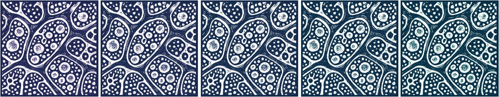

<code>davidnovak9000 at gmail dot com</code>

<strong><a href="cv.pdf">CV</a> • <a href="https://scholar.google.com/citations?user=FU7FJPcAAAAJ&amp;hl=en">Google Scholar</a> • <a href="https://github.com/davnovak">GitHub</a> • <a href="https://www.linkedin.com/in/david-novak-04b65989">LinkedIn</a></strong>

Hi there! I&#39;m a <strong>bioinformatics and machine learning consultant</strong> working with <a href="https://burnslsc.com">Burns LSC</a>.
With hands-on and leadership experience in bioinformatics, I focus mostly but not exclusively on flow cytometry, CyTOF, bulk and single-cell RNA-seq, and other NGS data.
I have a track record in algorithm development as well as more data-driven analytical workflows.
<strong>I am excited about responsible and interpretable AI and machine learning applications in biology.</strong>

<strong>Are you having trouble with your flow/spectral/mass cytometry, bulk/single-cell sequencing, image, or spatial data analysis?
I can help.</strong>
Feel free to e-mail me, and we'll discuss what I can do for you.

During my PhD at <a href="https://saeyslab.sites.vib.be/en">Saeys Lab</a>, (VIB-UGent, Belgium), I advanced <strong>exploratory data analysis and statistical modelling of high-dimensional biological datasets</strong>.
I always put an emphasis on creating <strong>interactive solutions to keep domain experts in the loop</strong>.
I collaborate with immunologists, bioinformaticians, and computer scientists alike.

<strong>My background</strong>

 
<ul>
<li>
A Biology undergrad, I shifted toward <strong>computer science &amp; bioinformatics</strong> a year into my studies, completing a Bioinformatics MSc at <a href="https://natur.cuni.cz/en">Charles University</a>.
</li>
<li>
My research started at <strong><a href="https://clip.lf2.cuni.cz/en">Childhood Lekaemia Investigation Prague (CLIP)</a></strong>, a clinical and research lab.
Focusing chiefly on flow &amp; CyTOF data, I helped develop <a href="https://github.com/stuchly/tviblindi"><strong><em>tviblindi</em></strong></a>: a <strong>human-in-the-loop trajectory inference framework</strong> powered by persistent homology.
This allowed us to build <strong> multi-organ models of human <a href="https://elifesciences.org/reviewed-preprints/95861">B-cell</a> and <a href="https://onlinelibrary.wiley.com/doi/full/10.1002/eji.202451004">T-cell</a> development</strong>.
</li>
<li>
Having secured a personal <a href="https://www.fwo.be/en/support-programmes/all-calls/phd/phd-fellowship-strategic-basic-research/">FWO Strategic Basic Research grant</a>, I accepted a PhD position at <strong><a href="https://saeyslab.sites.vib.be/en">Saeys Lab</a>, Center for Inflammation Research, VIB-UGent</strong>.
<ul style="margin-top: 0; margin-bottom: 0;">
<li>
Heading a collab with colleagues at <a href="https://www.uclouvain.be/en">UCLouvain</a>, I led the development of <a href="https://github.com/saeyslab/ViVAE"><strong><em>ViVAE</em></strong></a> and <a href="https://github.com/saeyslab/ViScore"><strong><em>ViScore</em></strong></a>: a novel trustworthy <strong>dimension-reduction</strong> model with QC measures grounded in differential geometry, and a <strong>framework for robustly evaluating low-dimensional data embeddings</strong>.
</li>
<li>
I'm leading a collaborative project with immunologists from <strong><a href="https://irp.nih.gov/pi/mario-roederer">Mario Roederer's lab</a>, Vaccine Research Center, NIH</strong>.
I designed <strong><a href="https://github.com/saeyslab/iidx"><em>iidx</em></a></strong>: an end-to-end workflow for large-scale statistical analysis of complex immunophenotype changes in cytometry data.
We managed to put together <strong>the largest high-dimensional cytometry map of immune system changes linked to age and sex to date</strong>, with a cohort of 2196 human donors.
</li>
</ul>
</li>
<li>
I designed and taught <strong>practical sessions for over 200 machine learning students</strong> over 4 years at Ghent University, as well as guiding individuals and groups with their projects.
Additionally, I co-organised the inaugural <a href="https://training.vib.be/all-trainings/computational-cytometry-summer-school">Computational Cytometry Summer School</a>, <strong>teaching statistical analysis for computational cytometry</strong>.
</li>
</ul>

<h2 id="my-blog">Blog posts</h2>

Some of my most interesting experiments and workflows: <strong>open-source, reproducible, and fully documented</strong>.
Here they are:

<ul>
<li>
<a href="https://davnovak.github.io/docs/exploratory_cluster_analysis/vignette.html"><strong>Exploratory cluster analysis in cytometry, made efficient</strong></a> (2025-08-07)
</li>
<li>
<a href="https://davnovak.github.io/docs/cytoSNOW/vignette.html"><strong>Fast cytometry analysis with <i>cytoSNOW</i></strong></a> (2025-07-23)
</li>
</ul>

<h2 id="my-projects">Portfolio</h2>

A selection of my projects (incl. collaborations) can be found below.
For most, code and documentation are up on GitHub.
In some cases, the release of all materials is pending journal publication.

<strong>Dimensionality reduction</strong> and <strong>structure learning</strong>

<h4><a href="https://github.com/saeyslab/ViVAE"><strong>ViVAE</strong></a></h4>

Framework for generating low-dimensional embeddings of single-cell genomics/cytometry datasets.
We show <i>ViVAE</i> to <strong>improve multi-scale structure preservation, interpretability, and QC mechanisms</strong>.
Using VAEs, a novel stochastic-MDS loss (based on <a href="https://github.com/PierreLambert3/SQuaD-MDS-and-FItSNE-hybrid">SQuadMDS</a>), and data denoising, we achieve a better balance of local and global structure preservation.
The model is equipped with a new algorithm for detecting latent space distortions (<strong>encoder indicatrices</strong>) and integrates with <a href="https://github.com/saeyslab/FlowSOM_Python">FlowSOM</a> for exploratory analysis.
I am the first author of the associated manuscript, which I penned with my co-authors from Ghent University and UCLouvain (under review at Cell Systems; read current <a href="https://www.biorxiv.org/content/10.1101/2023.11.23.568428v3">pre-print</a> here).
The work was presented at CYTO 2024.

<h4><a href="https://github.com/saeyslab/GroupEnc"><strong>GroupEnc</strong></a></h4>

<em>GroupEnc</em> is a proof-of-concept project for <strong>parametric multi-dimensional scaling (MDS) on the GPU</strong>, which I presented at BNAIC/BeNeLearn 2023.
Check out the conference paper <a href="https://bnaic2023.tudelft.nl/static/media/BNAICBENELEARN_2023_paper_46.9317ce00beb72bf31803.pdf">here</a>.

Topological <strong>trajectory inference</strong>

<h4><a href="https://github.com/stuchly/tviblindi"><strong>tviblindi</strong></a></h4>

<em>tviblindi</em> is a <strong>semi-supervised single-cell trajectory inference (TI) tool</strong>.
For my master thesis, I implemented parts of the topological data analysis (TDA) pipeline in C++ and created a <strong>method for clustering trajectories based on persistent homology</strong>, as well as a <strong>GUI implemented in R Shiny</strong>.
This allowed for a human-in-the-loop solution to interrogating developmental trajectories and building <strong>multi-organ models of B- and T-lymphopoiesis</strong>.
Check out the related publications pertaining, respectively, to <a href="https://onlinelibrary.wiley.com/doi/10.1002/eji.202451004">B-cell</a> and <a href="https://elifesciences.org/reviewed-preprints/95861/figures">T-cell</a> development.

Large-scale <strong>differential expression</strong> analysis

<h4><a href="https://github.com/saeyslab/iidx"><strong><em>iidx:</em> interpretable and interactive differential expression in cytometry</strong></a></h4>

<i>iidx</i> is <strong>the most comprehensive workflow for pre-processing and differential expression analysis in large cytometry cohorts to date</strong>.
Thomas Liechti and I presented this work at CYTO 2025.
The repository already contains the code for reproducing our analysis.
The data will be available once the manuscript (which is in preparation) is published.

<h4><a href="https://github.com/davnovak/tidycell"><strong>tidycell</strong></a></h4>

<em>tidycell</em> is a basic differential expression analysis tool written in R for cytometry data.
I developed this ad hoc during my time at <a href="https://clip.lf2.cuni.cz/cs">CLIP</a>.
It has been applied to GvHD data and in a project on head &amp; neck cancers at <a href="https://www.biocev.eu/en">Biocev</a>.
It is less elaborate than <i>iidx</i>, but it integrates <i>CellCnn</i> as an interesting approach to <strong>supervised feature extraction and addressing the multiple testing correction problem in smaller datasets</strong>.
This is done in addition to Wilcoxon ranked-sum testing of differential abundance.

<strong>Accelerating</strong> single-cell data <strong>annotation and exploration</strong>

<h4><a href="https://github.com/saeyslab/SingleBench"><strong>SingleBench</strong></a></h4>

<em>SingleBench</em> will get you from data to discovery faster.
It is an R framework for <strong>better interpretation of cytometry clustering, hyperparameter tuning &amp; benchmarking</strong>.
In particular, <strong>it makes exploratory cluster analysis fast and clear</strong>.
It also allows you to test the influence of <strong>iterative data denoising (smoothing), which is poised to become more relevant as the dimensionality of cytometry data increases</strong> (with spectral and, to some extent, CyTOF).
Featured in my <a href="https://davnovak.github.io/docs/exploratory_cluster_analysis/vignette.html">blog post</a> on exploratory cluster analysis in cytometry.

<h4><a href="https://github.com/davnovak/cytoSNOW"><strong>cytoSNOW</strong></a></h4>

<em>cytoSNOW</em> takes the standard <a href="https://www.nature.com/articles/s41596-021-00550-0">FlowSOM protocol</a> and speeds it up, to work fast with big data.
I'm interested in <strong>making computational cytometry accessible to anyone, even without fancy hardware</strong>--this is a step in that direction.

I wrote up a small <a href="https://davnovak.github.io/docs/cytoSNOW/vignette.html">blog post</a> on my <i>cytoSNOW</i> workflow, showing how it gave a 4.6-fold speed-up in a large computational cytometry workflow on my laptop.

<h4><a href="https://github.com/davnovak/hloss"><strong>hloss</strong></a></h4>

<em>hloss</em> is work that I presented at the ABLS 2022 bioinformatics conference.
It tackles the issue of <strong>evaluating cell type classification in single-cell data in a way that reflects known hierarchies and ontologies</strong>.
A novel scoring approach incorporates a biological prior to assess error based on degrees of relatedness.

<h4><a href="https://github.com/davnovak/SplitScore"><strong>SplitScore</strong></a></h4>

Work in progress on alternatives to hierarchical metaclustering used in <a href="https://github.com/saeyslab/FlowSOM">FlowSOM</a>.
Clusters are merged so as to preserve reasonable signal distributions per channel.
In practice, this can be done through <strong>preserving unimodality of marker expression, especially for markers that denote cell types (for cytometry data)</strong>.
This is an ongoing effort, since the requirement of preserving some distribution modalities in metaclustering arises now and then in different projects.

<strong>Evaluating single-cell data embeddings</strong>

<h4><a href="https://github.com/saeyslab/ViScore"><strong>ViScore</strong></a></h4>

<em>ViScore</em> is a collection of <strong>evaluation metrics for dimensionality reduction</strong> that address past problems with <strong>fairness and scalability</strong>.
Together with collaborators from UCLouvain, we put together a battery of both unsupervised and supervised evaluation algorithms and an <strong>extensible HPC benchmarking framework</strong>.
We build on <strong>RNX curves</strong> and the <a href="https://github.com/akonstodata/NPE"><strong>Neighbouhood Proportion Error</strong></a> to provide novel embedding-level and population-level scores.
This is described in our <em>ViVAE</em> <a href="https://www.biorxiv.org/content/10.1101/2023.11.23.568428v3">pre-print</a>.
We&#39;re incorporating some of the evaluation metrics from <em>ViScore</em> into <a href="https://github.com/aida-ugent/TRACE"><strong>TRACE</strong></a>, as presented at CYTO 2025 by <a href="https://github.com/laura-hajzokova">Laura Hajzoková</a>.

Miscellaneous

<h4><a href="https://github.com/davnovak/qctoy"><strong>qctoy</strong></a></h4>

<em>qctoy</em> is an R package for <strong>simulating aberrances in flow cytometry measurements</strong> that are relevant in designing QC tools and pipelines.
I developed this small tool during a summer internship in 2019 at SaeysLab to help with designing the QC algorithm what eventually became <a href="https://bioconductor.org/packages/release/bioc/html/PeacoQC.html"><strong>PeacoQC</strong></a>.

<h4><a href="https://github.com/davnovak/auto_compensate"><strong>auto_compensate</strong></a></h4>

<em>auto_compensate</em> is an automated pipeline for large-scale <strong>cytometry data compensation</strong> which I designed for <a href="https://clip.lf2.cuni.cz/cs">CLIP</a>.

<h4><a href="https://github.com/davnovak/RCondaRun"><strong>RCondaRun</strong></a></h4>

<em>RCondaRun</em> is a tiny package for <strong>switching between Conda environments within a single R session when interfacing with Python</strong>.

<h4><a href="https://github.com/davnovak/hidden"><strong>hidden</strong></a></h4>

<em>hidden</em> is a <strong>hidden Markov model simulator</strong> in R.
I wrote it because I find HMMs fun and wanted to understand them better.

<h4><a href="https://github.com/katebrich/command_line_parser"><strong>CommandLineParser</strong></a></h4>

<em>CommandLineParser</em> is a <strong>C#/.NET API</strong> for a command line interface that I co-wrote with <a href="https://github.com/katebrich">Kačka Břicháčková</a>.
This is a course project we teamed up for during our Master&#39;s in Bioinformatics at Charles University.

<h4><a href="https://github.com/davnovak/avl_tree"><strong>avl_tree</strong></a></h4>

<em>avl_tree</em> is an <strong>Adelson-Velsky and Landis tree implementation in Pascal</strong>.
It&#39;s some of my earliest code, written during my Bachelor&#39;s in Biology during which I took elective computer science courses.

