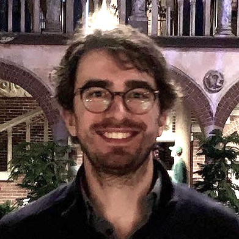

```davidnovak9000 at gmail dot com```

### [View my full CV here.](cv.pdf)

I am a bioinformatician and PhD researcher at [Saeys lab](https://saeyslab.sites.vib.be/en), [Center for Inflammation Research](https://www.irc.ugent.be) of the Flemish Institute of Biotechnology and Ghent University in Ghent, Belgium.
I am currently working on my PhD, having secured an [FWO Strategic Basic research](https://www.fwo.be/en/fellowships-funding/phd-fellowships/phd-fellowship-strategic-basic-research/) fellowship.

My main interest is machine learning (including deep learning) and applying it in biomedical contexts.
My favourite biological data is single-cell, because of how it can expand our understanding of the human immune system and other parts of our biology.

#### **I am open to part-time remote work in Q4 of 2024 and to full-time in Q1 2025 (after finishing my PhD, open to relocation).**

See my [Google Scholar](https://scholar.google.com/citations?user=FU7FJPcAAAAJ&hl=en) profile for publication activity.

Some of my publicly available project repositories, including collaborations, are listed below.

### [**ViVAE**](https://github.com/saeyslab/ViVAE)

*ViVAE* is a dimensionality reduction algorithm implemented in Python, aimed at creating useful embeddings of cytometry and scRNA-seq data.
This work was presented at CYTO 2024.
Using variational autoencoders and a stochastic multi-dimensional scaling (MDS) loss (adapted version of idea from [SQuadMDS](https://github.com/PierreLambert3/SQuaD-MDS-and-FItSNE-hybrid)), we achieve a better balance of local and global structure preservation, particularly with scRNA-seq.
We also adopt the differential geometry concept of indicatrices to quantify distortion of latent space by the encoder in an objective manner.
I am the first author of a manuscript we are now revising with my co-authors from Ghent University and UCLouvain (read first version of the [pre-print](https://www.biorxiv.org/content/10.1101/2023.11.23.568428v2) here).

### [**ViScore**](https://github.com/saeyslab/ViScore)

*ViScore* is a collection of evaluation metrics for dimensionality reduction.
Since previously published evaluation methods suffer from severe drawbacks, together with collaborators from UCLouvain we have released a battery of both unsupervised and supervised evalation metrics.
They build on RNX curves and the [Neighbouhood Proportion Error](https://github.com/akonstodata/NPE) to provide embedding-level and population-level scores.
The current version is described in our *ViVAE* [pre-print](https://www.biorxiv.org/content/10.1101/2023.11.23.568428v2).

### [**GroupEnc**](https://github.com/saeyslab/GroupEnc)

*GroupEnc* is a project I presented at the BNAIC/BeNeLearn 2023 machine learning conference.
Implemented in Python, this work is similar in spirit to *ViVAE* in that it uses a VAE architecture for generating embeddings with an MDS scaling criterion.
This work is more conceptual and allows for varying more hyperparameters, as well as dispensing with the decoder to create a faster-training encoder-only model to produce embeddings with significantly better global structure preservation than a VAE does.
The KL-divergence term from VAEs is kept, in order to obtain an interpretable latent space.

### [**tviblindi**](https://github.com/stuchly/tviblindi)

*tviblindi* is a semi-supervised trajectory inference tool for single-cell data (originally designed for CyTOF) that uses topological data analysis (TDA) and persistent homology to be able to work with the full, high-dimensional data, mitigating loss of information due to dimensionality reduction.
For my master thesis, I implemented parts of the TDA pipeline in C++ and created a method for clustering trajectories based on persistent homology, as well a GUI for semi-supervised analyses using that clustering, in R & Shiny.
To my knowledge, the approach of clustering high-dimensional trajectories in building multi-organ models of development is rather novel, and as such interesting in future applications, also on longitudinal data.

### [**hloss**](https://github.com/davnovak/hloss)

*hloss* is a work I presented at the ABLS 2022 bioinformatics conference, implemented in R.
This project tackles the issue of evaluating a cell type classification in single-cell data while considering a known hierarchical structure of phenotypes.
I introduce a novel scoring approach, which incorporates the biological prior to assess error based on degrees of relatedness.

### [**npefaster**](https://github.com/davnovak/npefaster)

*npefaster* is an optimised and extended version of the [Neighbouhood Proportion Error](https://github.com/akonstodata/NPE).
It addresses some methodological issues (eg. total variation distance to quantify difference between trajectories), allows for separate evaluation by population and runs faster.
The ViVAE pre-print supplementary materials (xNPE section) gives pseudocode and a case-study using synthetic data to demonstrate quantitatively which types of distortion the scoring can or cannot detect.

### [**SplitScore**](https://github.com/davnovak/SplitScore)

Work in progress on alternatives to hierarchical metaclustering done by FlowSOM.
Clusters are merged so as to preserve a cohesion in terms of signal distribution per channel.
In practice, this can be done through preserving unimodality of marker expression (for cytometry data).
This is an ongoing effort, since the requirement of preserving some distribution modalities in metaclustering arises now and then in different projects.

### [**SingleBench**](https://github.com/davnovak/SingleBench)

*SingleBench* is a benchmarking framework for high-dimensional data transformations and clustering in R.
Relying on HDF5 and recycling of intermediate results, it enables extensive hyperparameter sweep and easy interpretation of results.
It is designed to be highly extensible.
I presented this work at CYTO 2021.
If I have time in the last months of my PhD, I will document everything properly, add a few more things to it and publish.

### [**tidycell**](https://github.com/davnovak/tidycell)

*tidycell* is a differential expression analysis tool written in R for cytometry data that I developed when working at Childhood Leukaemia Investigation Prague.
It combines two pipelines: one based on FlowSOM clustering and one based on extraction of learned convolutional filters from CellCnn.
It has been applied in a project with CyTOF data at [Biocev](https://www.biocev.eu/en).

### [**qctoy**](https://github.com/davnovak/qctoy)

*qctoy* is an R package for simulating aberrances in flow cytometry measurements that are relevant in designing QC tools and pipelines.
I developed this small tool during a summer internship to help with designing the QC algorithm what eventually became [PeacoQC](https://bioconductor.org/packages/release/bioc/html/PeacoQC.html).

### [**auto_compensate**](https://github.com/davnovak/auto_compensate)

*auto_compensate* is an automated pipeline for cytometry data compensation I designed at Childhood Leukaemia Investigation Prague.

### [**hidden**](https://github.com/davnovak/hidden)

*hidden* is a neat hidden Markov model simulator in R.
I wrote to understand HMMs better.

### [**CommandLineParser**](https://github.com/katebrich/command_line_parser)

*CommandLineParser* is a C#/.NET API I co-wrote with [Kačka Břicháčková](https://github.com/katebrich).
This is a course project we teamed up for during our Master's in Bioinformatics at Charles University.

### [**avl_tree**](https://github.com/davnovak/avl_tree)

*avl_tree* is an Adelson-Velsky and Landis tree implementation in Pascal.
It's some of my earliest code, written during my Bachelor's in Biology, in an effort to shift away from wet lab work to coding.

### [**RCondaRun**](https://github.com/davnovak/RCondaRun)

*RCondaRun* is a tiny package for switching between Conda environments within a single R session when interfacing with Python.

<hr>

Interested in my work or collaborating?
Don't hesitate to e-mail me!




