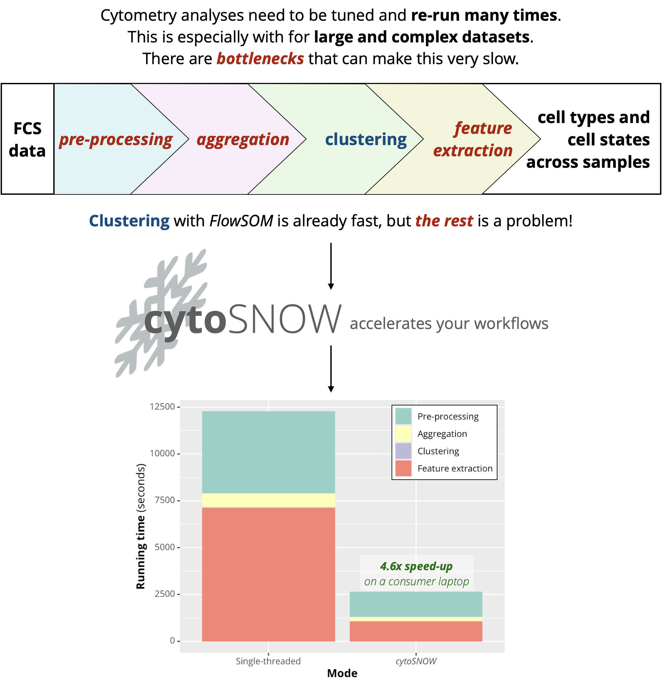

```{r setup, include=FALSE}
knitr::opts_chunk$set(echo = TRUE)
```

**Flow cytometry datasets are increasing in size, complexity, and quality.** This is happening as the technology and experimental protocols advance.
Much of the recent progress is and will be fueled by better **standardisation** of data, which makes it possible to include **massive amounts of samples in a single study**.

## Problem setting

Large cohorts of data present a range of challenges for computational cytometrists.
From QC and pre-processing, through signal normalisation and cluster analyses, to differential expression modelling, **cytometry pipelines require tuning, and lots of it**.

::: {style="border: 1px solid #4A90E2;      border-radius: 10px;              padding: 10px;                  background-color: #f0f8ff;      color: #333333;                 margin: 10px 0;"}
A large computational pipeline can require **hundreds of re-runs**, and **close coordination of the data analyst with domain experts is a must**.

When working with datasets from hundreds of donors/patients, **re-running the pipelines takes a great deal of computing power and time**.
This makes computational cytometry work inaccessible if you don't have powerful hardware.
:::

## Aims of this project

I identified some of the bottlenecks in computational cytometry workflows (based on the [FlowSOM protocol](https://www.nature.com/articles/s41596-021-00550-0)) and accelerated them.
**This will allow you to run large analyses on a consumer laptop not in days, but in hours or minutes.** Let me show you what I mean by that:

{width="700"}

As you can see, a number of steps in the workflow are major bottlenecks once the number of samples you're working with becomes high.
**Luckily, I got a massive speed-up by rewriting some FlowSOM functions to work multi-threaded (using multiple CPU cores), as well as writing some new ones.**

In practice, I took a pipeline that would otherwise run for 3 hours and 25 minutes on my computer and made it run in 44 minutes.

::: {style="border: 1px solid #4A90E2;      border-radius: 10px;              padding: 10px;                  background-color: #f0f8ff;      color: #333333;                 margin: 10px 0;"}
**To give everyone the opportunity to speed up their cytometry data analyses, I created the [*cytoSNOW*](https://github.com/davnovak/cytoSNOW) R package.** Each function in it is carefully documented, and it runs a number of sanity checks on the input parameters that allow you to spot potential errors easily.
:::

The focus of this case study is **speed of execution**.
The code that I give below covers the creation of a large synthetic dataset and a standard computational workflow.
You can easily test the workflow on real large flow cytometry datasets (*e.g.*, from *ImmPort*, or from your own projects).
The speed-up that I got on a consumer laptop using 7 CPU cores looks like this:

## Reproducible code

In the workflow given below, we evaluate the time needed to execute a synthetic pre-processing, data aggregation, clustering, and feature extraction workflow.
The running times with and without the use of *cytoSNOW* are ultimately compared.

The packages required for running the workflow itself are `flowCore`, `FlowSOM`, `cytoSNOW`, and `bench`.

To plot a comparison of running times using a stacked bar plot, `tidyverse` and `ggtext` are also needed.

The code was tested on a consumer laptop (MacBook Air M1 with 16GB RAM) with *cytoSNOW* using 7 CPU cores.

### Simulating data

Let's start by simulating a random **2000-sample dataset**, with 30,000 cells and 30 markers measured per sample.
Additionally, we create a random spillover matrix and signal transformation instructions as a `flowCore::transformList`, to be able to do **standard flow cytometry data** **pre-processing**.

To save disk space in this experiment, we just use the same synthetic file 2000 times.
(Normally, *cytoSNOW* would then give an error when seeing duplicit samples. To make an exception here, we set the environment variable `'DUPLICATE_EXCEPTION'` to `TRUE`.)

```{r, eval = FALSE, cache = TRUE}

## Decide dataset size and complexity ----

N  <- 2000 # sample count
nr <- 3e5  # cells per sample
nc <- 30   # number of markers

## Distinguish between cell type vs state markers ----

idcs_type  <- 1:20 # markers for cell type
idcs_state <- 21:30 # markers for cell state

## Simulate random expression data ----

markers <- paste0('Marker', seq_len(nc))
set.seed(1); ff <- cytoSNOW::ValidateFCS(
  `colnames<-`( # Gaussian noise
    matrix(rnorm(nr*nc, mean = 10, sd = 5), ncol = nc),
    markers
  )
)

## Generate a spillover matrix for compensation ----

set.seed(1); spillover <- # Gaussian noise with 1 on the diagonal
  `diag<-`(matrix(abs(rnorm(nc**2, mean = 1e-2, sd = 1e-3)), ncol = nc), 1.)
rownames(spillover) <- colnames(spillover) <- markers

## Generate transformation instructions ----

tf_list <- flowCore::transformList(
  from = markers, tfun = flowCore::arcsinhTransform(b = 120)
)

## Save the expression data in an FCS file ----

fname_input <- 'InputSample.fcs'
flowCore::write.FCS(ff, fname_input)
fnames <- rep(fname_input, times = N)

## Allow for reusing the FCS sample (for simulation) ----

Sys.setenv( # exception to use same file multiple times
  'DUPLICATE_EXCEPTION' = TRUE 
)
```

### Pre-processing

Compensation and transformation of the fluorescence signal can itself take a long time.
The code snippet below compares the time needed to do this single-threaded (`t_pre0`) and multi-threaded using *cytoSNOW* (`t_pre1`).

```{r, eval = FALSE, cache = TRUE}

## Set directory to save pre-processed files ----

fpath_out <- 'preprocessed'
if (!file.exists(fpath_out)) {
  dir.create(fpath_out)
}

## Evaluate single-threaded pre-processing loop ----

t_pre0 <- bench::system_time({ 
  pb <- txtProgressBar(min = 0, max = N, style = 3) # to show progress
  for (i in seq_along(fnames)) { # iterate over FCS files
    fname <- fnames[i]
    ff    <- flowCore::read.FCS(fname)
    ff    <- flowCore::compensate(ff, spillover)
    ff    <- flowCore::transform(ff, tf_list)
    flowCore::write.FCS(
      x        = cytoSNOW::ValidateFCS(ff@exprs, ff),
      filename = file.path(fpath_out, basename(fname))
    )
    setTxtProgressBar(pb, i)
  }
  close(pb)
})
t_pre0 <- t_pre0['real']

## Evaluate cytoSNOW's pre-processing function ----

t_pre1 <- bench::system_time({ 
  cytoSNOW::ParallelPreprocess(
    fnames     = fnames,
    fpath_out  = fpath_out,
    compensate = TRUE,
    spillover  = spillover,
    transform  = TRUE,
    tf_list    = tf_list
  )
})
t_pre1 <- t_pre1['real']

## Collect paths to pre-processed file(s) ----

fnames_pre <- rep(
  file.path(fpath_out, fname_input), times = N
)

## Report times ----

message(
  'Running times:\n\t',
  '-> single-threaded:\t', t_pre0, ' \n\t',
  '-> with cytoSNOW:\t',  t_pre1
)
```

Note the use of `cytoSNOW::ValidateFCS`: this just makes sure that all the properties of the pre-processed FCS files are valid and there won't be an error message when trying to import the files in the future.

### Aggregation

The next step in the standard *FlowSOM* protocol is to aggregate expression data from all the pre-processed files, to obtain a large aggregate of training data for the clustering model.

In the snippet below, we compare the time needed to do this using `FlowSOM::AggregateFlowFrames` versus the customised `cytoSNOW::ParallelAggregate` function.

```{r, eval = FALSE, cache = TRUE}

## Evaluate single-threaded flowFrame aggregation ----

t_agg0 <- bench::system_time({ 
  agg0 <- FlowSOM::AggregateFlowFrames(
    fileNames = fnames_pre, cTotal = 1e6, silent = TRUE
  )
})
t_agg0 <- t_agg0['real']
saveRDS(agg0, 'agg0.RDS')

## Evaluate aggregation with cytoSNOW ----

t_agg1 <- bench::system_time({
  agg1 <- cytoSNOW::ParallelAggregate(fnames = fnames_pre, N = 1e6)
})
t_agg1 <- t_agg1['real']
saveRDS(agg1, 'agg1.RDS')

## Report times ----

message(
  'Running times:\n\t',
  '-> single-threaded:\t', t_agg0, ' \n\t',
  '-> with cytoSNOW:\t',  t_agg1
)
```

### Clustering

*FlowSOM* clustering itself is actually very fast.
There have been numerous approaches that speed it up further, but in practice this is rarely the real bottleneck.

```{r, eval = FALSE, cache = TRUE}

## Evaluate FlowSOM clustering ----

t_fsom <- bench::system_time({
  fsom <- FlowSOM::FlowSOM(agg1, nClus = 40, colsToUse = markers[idcs_type])
})
t_fsom <- t_fsom['real']
saveRDS(fsom, 'fsom.RDS')

## Report time ----

message(
  'Running time:\t', t_fsom, ' seconds'
)
```

Note that we'd typically use the cell *type* markers for clustering, and not the cell *state* markers, which are more transient and subject to a different type of analysis downstream.

### Feature extraction

A key component of the analytical workflow is the extraction of sample-level features derived from the *FlowSOM* model.

The relative abundances of clusters and metaclusters per sample allow us to investigate compositional differences between the donors/patients.
In other words, different cell types can be over- or under-abundant based on some condition (donor age, medical condition, ...).

In contrast, differences in expression levels or phenopositivity rates of transient state markers allow us to investigate shifts in cell states.

These two phenomena: **differential abundance** and **differential state**, can be tested using the [diffcyt](https://www.nature.com/articles/s42003-019-0415-5) framework.

However, to be able to statistically model these differences at all, we need to extract the abundance/state values for each FCS sample.
Classically, this is done using `FlowSOM::GetFeatures`.
The faster way of doing so is using `cytoSNOW::ParallelGetFeatures`.

```{r, eval = FALSE, cache = TRUE}

## Evaluate FlowSOM feature extraction ----

t_fe0 <- bench::system_time({
  suppressWarnings({
    fe0 <- FlowSOM::GetFeatures(
      fsom   = fsom,
      files  = fnames_pre,
      level  = c('clusters', 'metaclusters'),
      type   = c('counts', 'percentages', 'MFIs'),
      MFI    = markers[idcs_state],
      silent = TRUE
    )
  })
})
t_fe0 <- t_fe0['real']
saveRDS(fe0, 'fe0.RDS')

## Evaluate cytoSNOW feature extraction ----

t_fe1 <- bench::system_time({
  fe1 <- cytoSNOW::ParallelGetFeatures(
    fsom          = fsom,
    fnames        = fnames_pre,
    level         = c('clusters', 'metaclusters'),
    type          = c('counts', 'proportions', 'medians'),
    state_markers = markers[idcs_state]
  )
})
t_fe1 <- t_fe1['real']
saveRDS(fe1, 'fe1.RDS')

## Report times ----

message(
  'Running times:\n\t',
  '-> single-threaded:\t', t_fe0, ' \n\t',
  '-> with cytoSNOW:\t',  t_fe1
)
```

### Comparison of running times

Finally, to compare the running times per step (as you've seen in the figure at the top), we make a simple stacked bar plot.
This shows you how long each of the steps takes, and how the running times differ between the single-threaded setting and when using my *cytoSNOW* package.

```{r, eval = FALSE, cache = TRUE}

## Collect data and create a stacked bar plot ----

library(tidyverse)
library(ggtext)

d <- data.frame(
  'Procedure' = rep(
    c('Pre-processing', 'Aggregation', 'Clustering', 'Feature extraction'),
    each = 2
  ),
  'Mode' = rep(
    c('Single-threaded', '*cytoSNOW*'),
    times = 4
  ),
  'Time' = as.numeric(c(
    t_pre0, t_pre1,
    t_agg0, t_agg1,
    t_fsom, t_fsom,
    t_fe0,  t_fe1
  ))
) %>% 
  dplyr::mutate(
    Procedure = factor(Procedure, levels = unique(Procedure)),
    Mode      = factor(Mode,      levels = unique(Mode))
  )
  
d %>% 
  ggplot(
    aes(x = Mode, y = Time, label = Time, fill = Procedure)
  ) +
  geom_bar(
    position = 'stack', stat = 'identity'
  ) +
  scale_fill_brewer(palette = 'Set3') +
  ggtitle('Comparison of running times') +
  ylab('**Running time** (seconds)') +
  xlab('**Mode**') +
  theme(
    axis.title.x = element_markdown(),
    axis.title.y = element_markdown(),
    axis.text.x = element_markdown(),
    axis.text.y = element_markdown()
  )
```

Let's get a final comparison of the numbers, divided by the consecutive steps in the pipelines, and summed for the workflow.

```{r, eval = FALSE, cache = TRUE}

## Report times and speed-ups ----

t_total0 <- t_pre0+t_agg0+t_fsom+t_fe0
t_total1 <- t_pre1+t_agg1+t_fsom+t_fe1

f_mins <- function(x) {
  x <- as.numeric(x)/60
  paste0(
    sprintf(round(x, 1), fmt = '%6.1f'),
    if (as.numeric(t_pre0)>1) ' minutes' else 'minute'
  )
}
f_speedup <- function(x0, x1) {
  sprintf(round(as.numeric(x0)/as.numeric(x1), 1), fmt = '%3.1f')
}

message(
  'Pre-processing\n',
  '\tsingle-threaded:', f_mins(t_pre0), '\n',
  '\tcytoSNOW:       ', f_mins(t_pre1), '\n',
  '\t-> speed-up:       ', f_speedup(t_pre0, t_pre1), 'x\n'
)
message(
  'Aggregation\n',
  '\tsingle-threaded:', f_mins(t_agg0), '\n',
  '\tcytoSNOW:       ', f_mins(t_agg1), '\n',
  '\t-> speed-up:       ', f_speedup(t_agg0, t_agg1), 'x\n'
)
message(
  'Clustering\n',
  '\tsingle-threaded:', f_mins(t_fsom), '\n'
)
message(
  'Feature extraction\n',
  '\tsingle-threaded:', f_mins(t_fe0), '\n',
  '\tcytoSNOW:       ', f_mins(t_fe1), '\n',
  '\t-> speed-up:       ', f_speedup(t_fe0, t_fe1), 'x\n'
)
message(
  'Entire workflow\n',
  '\tsingle-threaded:', f_mins(t_total0), '\n',
  '\tcytoSNOW:       ', f_mins(t_total1), '\n',
  '\t-> speed-up:       ', f_speedup(t_total0, t_total1), 'x\n'
)
```

Note that I ran this using 7 CPU cores and a not-so-powerful laptop (MacBook Air M1 from 2020).
If you have more CPU cores, you will get more speed-up.

## Future

I'd love to see researchers in computational cytometry use *cytoSNOW*, so we can build on this and help streamline large workflows!
Saving time and resources is key.

While existing R frameworks for parallel computing in bioinformatics, like `BiocParallel`, go a long way to do this, we need **cytometry-specific tools** that make it a no-brainer.

In the future, I'd like to add functionality for **fast QC** (using *PeacoQC*, *flowAI*), **signal normalisation** (using *CytoNorm*), and **massive differential expression testing** (using *diffcyt*).
I have done initial work on that in the [*iidx*](https://github.com/saeyslab/iidx) framework.

There's work to be done to reduce the overhead associated with parallelising.
There's also an obvious opportunity to use **distributed computing** here.

## Alternatives to *cytoSNOW*

There are great alternatives to (and relatives of) *cytoSNOW*, each with its own strengths.

[`BiocParallel`](https://www.bioconductor.org/packages/devel/bioc/html/BiocParallel.html) is the go-to for general parallel evaluation compatible with Bioconductor objects.

[`CATALYST`](https://www.bioconductor.org/packages/devel/bioc/html/CATALYST.html) supports parallelisation via `BiocParallel` for a number of steps, from pre-processing up to differential expression analysis.
However, if you don't want to hold all data in memory, you have to manually chunk the data into multiple `SingleCellExperiment` objects to make things work.

[`ncdfFlow`](https://www.bioconductor.org/packages/devel/bioc/html/ncdfFlow.html) can be used to address the memory issue here.
However, in a real-life collaboration with domain experts (*e.g.*, immunologists), keeping FCS files as the format of choice (both of raw and pre-processed data) is easiest, and it avoids the need to load too much data into memory in the first place.

::: {style="border: 1px solid #4A90E2;      border-radius: 10px;              padding: 10px;                  background-color: #f0f8ff;      color: #333333;                 margin: 10px 0;"}
**My aim with *cytoSNOW* is to have a cytometry-specific solution that's extremely easy to deploy with close-to-zero overhead for the analyst to have things run in parallel.** And thus empower users with consumer-level hardware to do some great work with cytometry data!
:::

Did I miss an existing solution that you believe is better than mine?
Please [**let me know**](https://davnovak.github.io/)–I'll be happy to see what the most efficient way forward is to advance the field.

## Need help with your analyses?

I'm a freelance bioinformatics consultant passionate about cytometry, single-cell transcriptomics, and many other modalities of data.

::: {style="border: 1px solid #4A90E2;      border-radius: 10px;              padding: 10px;                  background-color: #f0f8ff;      color: #333333;                 margin: 10px 0;"}
**If you need help with your project, [reach out](https://davnovak.github.io/)!** We'll figure out how my expertise can empower you or your team to get to results in a robust, transparent, and efficient way.
:::
