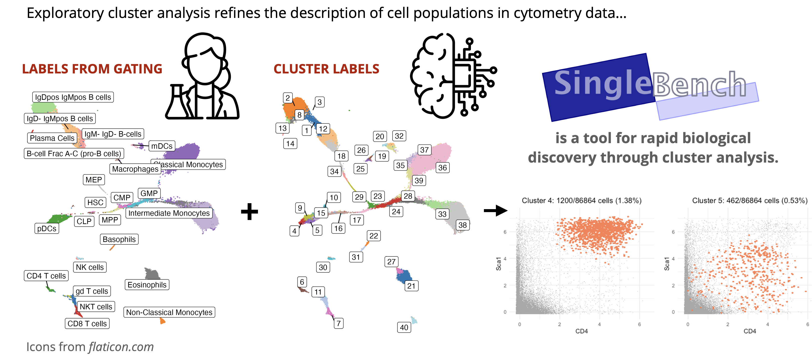
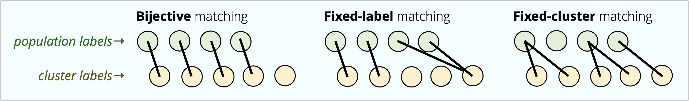

```{=html}
<style>
pre, code {
  font-size: 0.8em;
}
</style>
```

------------------------------------------------------------------------

```{r setup, include = FALSE}
knitr::opts_chunk$set(echo = TRUE, cache = TRUE)
```

**Exploratory data analysis (EDA) in cytometry is overwhelmingly powered by clustering and dimensionality reduction.** This project is a little case study into the clustering part.
I'll show you how I run my exploratory cluster analyses.

Using an **in-house framework for EDA written in R ([*SingleBench*](https://github.com/saeyslab/SingleBench))**, I apply clustering to efficiently identify subsets of [plasmacytoid dendritic cells](https://en.wikipedia.org/wiki/Plasmacytoid_dendritic_cell) in the [CyTOF mouse bone marrow data](https://www.nature.com/articles/nmeth.3863).
These subsets are described in the paper with which the data is associated, but not included in the original annotation provided in the public dataset (via [HDCytoData](https://www.bioconductor.org/packages/release/data/experiment/html/HDCytoData.html)).

By validating the findings, I demonstrate that my workflow **enables fast biological discovery of real cell subsets in cytometry data**.

::: {style="border: 1px solid #4A90E2;      border-radius: 10px;              padding: 10px;                  background-color: #f0f8ff;      color: #333333;                 margin: 10px 0;"}
The workflow presented here is based on a short chapter in my [PhD thesis](https://biblio.ugent.be/publication/01JYJYCNNWQ29Q2YNX9RTDHMHX).
I would like to thank [Sofie Van Gassen](https://www.linkedin.com/in/sofie-van-gassen-185a6467/?originalSubdomain=be) and [Yvan Saeys](https://www.linkedin.com/in/yvan-saeys-a13b6a/) of [SaeysLab](https://saeyslab.sites.vib.be/en) for supervision during the majority of this project's duration.
:::

## Problem setting

In cytometry, and single-cell biology more broadly, we confront the issue of a **'weak' ground truth**.
That is, the 'textbook' cell labels (*e.g.*, from manual gating) may not be fully reliable.
Or indeed not the only correct way to annotate the data!

::: {style="border: 1px solid #4A90E2;      border-radius: 10px;              padding: 10px;                  background-color: #f0f8ff;      color: #333333;                 margin: 10px 0;"}
When we compare clusters to manually labelled populations (assigned by an immunologist or whichever other domain expert), not all disagreements between the two indicate an error.
**The two annotations can instead represent an equally or more valid alternative solutions to the partitioning problem. Or, as we often see, a** **difference in resolution** (granularity) between the manual and the automated approach.

**But how do we leverage both gating and clustering to increase the resolution of our analysis, and power biological discovery?**
:::

## Aims of this project

Based on user experience and benchmarks, [*FlowSOM*](https://onlinelibrary.wiley.com/doi/full/10.1002/cyto.a.22625) has established itself as a well-performing clustering algorithm in computational cytometry.
**In the workflow described here, I'll reproduce the exact *FlowSOM* configuration used in the seminal benchmark study by [Weber and Robison (2016)](https://onlinelibrary.wiley.com/doi/full/10.1002/cyto.a.23030), and use it to increase the resolution of cell annotation in a bone marrow dataset**.

The *SingleBench* framework is here to take you from clustering to better description of cell subsets **fast**.
Down the line, it can also help you optimise your clustering configuration based on various scoring criteria.

<br>  <br>

## Walkthrough

**In the fully reproducible workflow below, we download our data, apply clustering, and analyse the results to obtain some biological insights.**

The required packages are `HDCytoData`, `FlowSOM`, and `SingleBench` (and their dependencies).
To install *SingleBench* specifically, run `devtools::install_github('saeyslab/SingleBench')` from your R console.

### Preparing data and defining a workflow

We will use *HDCytoData* to download the '*Samusik_01*' CyTOF dataset, comprising \~87k bone marrow cells from a single mouse.
This dataset is a **go-to for testing clustering algorithms** (*e.g.*, in the [2016 Weber and Robinson study](https://onlinelibrary.wiley.com/doi/full/10.1002/cyto.a.23030)).
It measures 39 surface protein markers, and it includes the cell-wise annotation of 24 populations.

```{r, eval = TRUE}

## Download the data ----

d <- suppressMessages(HDCytoData::Samusik_01_SE())
  # Samusik dataset as a SummarizedExperiment object
```

Based on documentation accessible via `?HDCytoData::Samusik_01`, **the expression data should be transformed using inverse hyperbolic sine** ('*arcsinh*') with a cofactor of 5.
This *arcsinh* cofactor value of 5, also given in [Nowicka et al. (2019)](https://f1000research.com/articles/6-748), is a standard choice when dealing with CyTOF data.
We will also only want to retain surface markers that are designated as '*type*' markers in the *SummarizedExperiment* object.

The snippet below sets up the entire pre-processing and clustering workflow.

```{r, eval = TRUE}

suppressMessages(library(SingleBench))

## Specify the clustering configuration ----

pipeline <- list()
pipeline[[1]] <-
  Subpipeline(
    clustering = Module(Fix('FlowSOM', grid_width = 10, grid_height = 10, n_clusters = 40))
  ) # all parameters fixed (~ no optimisation or tuning)

## Link it to the dataset ----

b <- Benchmark(
  input              = d,
  transform          = 'asinh',        # use arcsinh transformation
  transform_cofactor = 5,
  input_marker_types = 'type',         # use surface markers specified as 'type'
  unassigned_labels  = 'unassigned',   # unlabelled cells are marked as 'unassigned'
  pipeline           = pipeline,
  h5_path            = 'benchmark.h5', # path to HDF5 file with results (to prevent data loss)
  ask_overwrite      = FALSE           # if the HDF5 exists, don't ask just overwrite it
)

```

Note that the `Benchmark` object creates its auxiliary HDF5 file.
HDF5 is a hierarchical format for managing large and potentially complex data.
This allows us to easily run larger evaluations, for instance with multiple clustering workflows side-by-side for comparison.

::: {style="border: 1px solid #4A90E2;      border-radius: 10px;              padding: 10px;                  background-color: #f0f8ff;      color: #333333;                 margin: 10px 0;"}
If you're running a *SingleBench* workflow (`Benchmark`) and it gets interrupted, **the HDF5 file makes sure that the results generated up to that point do not get lost**, and you can simply return to the workflow and continue running it.
:::

### Running the workflow

The workflow, specified in object `b`, is now set up.
Executing it is simple.

```{r, eval = TRUE}

Evaluate(
  benchmark       = b,
  seed.clustering = 1
)
```

### Interpreting a clustering result

Under the hood, ***SingleBench*** **automatically computes multiple evaluation metrics** that are commonly used for clustering, including the adjusted Rand index (ARI), the Davies-Bouldin index (DB), and F-scores of cluster-population matches.

Now, this workflow is not about benchmarking, but it's useful to go over ways in which we can evaluate clustering with respect to manual annotation of cells, because it proves very useful for EDA!

::: {style="border: 1px solid #4A90E2;      border-radius: 10px;              padding: 10px;                  background-color: #f0f8ff;      color: #333333;                 margin: 10px 0;"}
The 'average *F-score*' (*F-measure*, *F1-score*) has become a standard supervised evaluation method for clustering.
It creates a **1-to-1 (bijective) matching of each (tentatively) labelled cell population to a cluster**.
The labels are expected to come from a manual gating of the populations.

A 1-to-1 matching means that no population is mapped onto multiple clusters, and no cluster is mapped onto multiple populations.
An F-score, which is a balance between recall and precision, is then computed for each of these matched pairs.
The average of these F-scores is then taken as an indication of how well the clustering matches the expert labeling of cells.

This is generally a great way to evaluate clustering performance.
But there are multiple limitations:

-   **It is typically recommended to overcluster (*i.e.*, specify more target clusters than there are known tentative populations).** When that happens, some clusters are left out of the 1-to-1 matching.

-   Averaging over the scores per match obscures that **some cell compartments may be described better than others by the clustering algorithm**.

-   **Manual gating might not be a good ground truth, or exclusively correct.** For instance, if your gating is very low-resolution (*e.g.*, only has a T-cell gate) and the clustering reveals true biological variation (*e.g.*, CD4 versus CD8 T cells), this will then be penalised, even though the clustering revealed something important.
    **There can also be multiple valid gating hierarchies.**

Hence, **if we're using clustering for EDA, we want to see *how the clustering can refine our labelling strategy***, to discover new subpopulations in the data.
For that, we actually consider 3 ways of matching the labelled populations to clusters:



**If we want to describe new subpopulations using clustering, the fixed-cluster matching is actually what we're interested in most often. You'll see that below.**
:::

Let me show you how to rapidly identify new subpopulations in our data, with the aid of our clustering model.
To do this, we will use **similarity heatmaps**:

```{r, eval = TRUE, fig.width = 10, fig.height = 7}

PlotSimilarityHeatmap(b)
```

**The heatmap above shows the labelled populations (rows) and the clusters (columns), and it indicates their overlaps (numbers) and how we can match them.** The 1-to-1 matches are on the diagonal in the top-left quadrant.
As you can see, there are quite a few clusters (on the right) that don't get a match that way.
But if we do look for populations that they capture best, we get the matches indicated by green frames.

Note, for instance, that:

-   Some 3/5 of all *plasmacytoid dendritic cells* (pDCs) fall into these green-framed clusters on the right (clusters 3, 5, 9, 16).
    This means that **FlowSOM divided the pDCs population into multiple smaller subsets, based on phenotypic differences between them**.

-   The clustering reveals subpopulations along the *common myeloid progenitors* (CMP) to *granulocyte-monocyte progenitors* (GMP) differentiation pathway (clusters 25, 39).
    Perhaps the gating there can be refined also.

-   **Some overlaps between clusters matchable to eosinophils, classical monocytes, and intermediate monocytes is indicated.** By investigating the identity of the respective populations and mixed clusters (*e.g.*, clusters 28, 34), we can figure out further whether this is a mistake in the gating, or in the clustering.

Once you get used to these similarity heatmaps, you can go from the clustering result to valuable insights very quickly.

### Describing new subpopulations

Let's investigate the pDC subpopulations identified by FlowSOM.
**We can use SingleBench to ask general questions, like '*what is cluster 9?*'** Remember, this was one of the green-framed clusters in the right part of the heatmap.
Let's use the `WhatIs` function to ask our query.

```{r, eval = TRUE, fig.width = 8, fig.height = 5}

WhatIs(b, cluster = 9)
```

This shows us overall expression levels by cells within this cluster (on the left: cluster-9 cells in orange, overall background expression in grey).
It also shows how correlated the expression of different markers is at a single-cell level (on the right).
In this case, we are mainly interested in the marker expressions.

**We can run the same query for the other clusters tentatively matched to pDCs to compare them.** This is what the profile looks like for cluster 5.

```{r, eval = TRUE, fig.width = 8, fig.height = 5}

WhatIs(b, cluster = 5)
```

If we look at these side-by-side, **we can identify differences in CD4 and Sca1 expression**, which turn out to be meaningful.
A quick Google Scholar search reveals that [Yang et al. (2005)](https://academic.oup.com/jimmunol/article-abstract/174/6/3197/8037378) have previously identified pDC subsets both with a CD4^-^ and a CD4^+^ phenotype, and [**Niederquell et al. (2013)**](https://onlinelibrary.wiley.com/doi/10.1002/eji.201343498) **have described Sca1 as defining pDC developmental stages that are strikingly different in their immune features**.
The subdivision into developmental stages is actually also described in the [Samusik et al. (2016)](https://www.nature.com/articles/nmeth.3863) study where this data originates from, even though the provided gating doesn't reflect it.

In other words, **we found a biologically relevant pattern using cluster analysis that we could have missed otherwise**.

Now, to compare the phenotype between the different clusters matched to pDCs, we use the `WhatIs` function again, but ask to show biaxial plots for the two markers of interest here.
(We'll use `cowplot` to create a grid of plots per cluster, actually.)

```{r, eval = TRUE, fig.width = 12, fig.height = 7}

cowplot::plot_grid( # create a grid of plots per cluster
  WhatIs(b, cluster =  4, marker1 = 'CD4', marker2 = 'Sca1', pointsize_fg = 4, pointsize_bg = 1),
  WhatIs(b, cluster =  3, marker1 = 'CD4', marker2 = 'Sca1', pointsize_fg = 4, pointsize_bg = 1),
  WhatIs(b, cluster =  5, marker1 = 'CD4', marker2 = 'Sca1', pointsize_fg = 4, pointsize_bg = 1),
  WhatIs(b, cluster =  9, marker1 = 'CD4', marker2 = 'Sca1', pointsize_fg = 4, pointsize_bg = 1),
  WhatIs(b, cluster = 16, marker1 = 'CD4', marker2 = 'Sca1', pointsize_fg = 4, pointsize_bg = 1), # ...specifying point sizes for foreground and background points
  nrow = 2
)

```

The differences here are notable.
We went from running *FlowSOM* to upping the resolution of our cell annotation.

Now, what if we want to export the expression data for different clusters to work with it further?
We simply use the `GetClustering` function, which gives us the labels, and the `GetExpressionData` function, which gives the actual pre-processed expression profiles per cell.

## Future

*SingleBench* is work in progress, but it already has lots more to offer.
I'm planning to write more about that in future blog posts.
Specifically, I will tell you at some point about:

-   incorporating **data denoising in exploratory workflows within cytometry**

-   using *SingleBench* to **rapidly tune the parameters of your clustering workflow**

In a future version of the framework, **I want to integrate queries to *ChatGPT* or *Perplexity***.
This will give a quick way to identify cell subsets, and find out which markers to focus on.
Once more standardised resources for cell type annotation are available (*e.g.*, thanks to the [*SOULCAP*](https://soulcap.org/) initiative), cell annotation is going to become more efficient.

## Alternatives to *SingleBench*

*SingleBench* is cytometry-specific, and sits at the intersection of workflow management, benchmarking, and exploratory visualisation.
As such, it has alternatives that are similar to it in some regards:

-   [`CytoPipeline`](https://www.bioconductor.org/packages/release/bioc/html/CytoPipeline.html) is a recent package for automating and visualisation of flow cytometry data analysis workflows.
    However, it focuses on QC and pre-processing, which distinguishes it clearly from *SingleBench*.

-   [`CATALYST`](https://www.bioconductor.org/packages/release/bioc/html/CATALYST.html) is a fantastic framework geared towards pre-processing and differential expression analyses.
    It uses S4 classes from the Bioconductor ecosystem and is well documented.
    It does not have the emphasis on exploratory cluster analysis that *SingleBench* does.

-   [`pipeComp`](https://github.com/plger/pipeComp) is a more general framework for workflow management, developed with scRNA-seq data in mind.
    It is more flexible and broader in scope.

-   [`Nextflow`](https://www.nextflow.io/) is a powerful workflow system, popular within bioinformatics particularly for executing large pipelines on the cloud.
    The specification of workflows is again broader, and the framework is very general.

## Need help with your analyses?

I'm a freelance bioinformatics consultant passionate about cytometry, single-cell transcriptomics, and many other modalities of data.

::: {style="border: 1px solid #4A90E2;      border-radius: 10px;              padding: 10px;                  background-color: #f0f8ff;      color: #333333;                 margin: 10px 0;"}
**If you need help with your project, [reach out](https://davnovak.github.io/)!** We'll figure out how my expertise can empower you or your team to get to results in a robust, transparent, and efficient way.
:::
